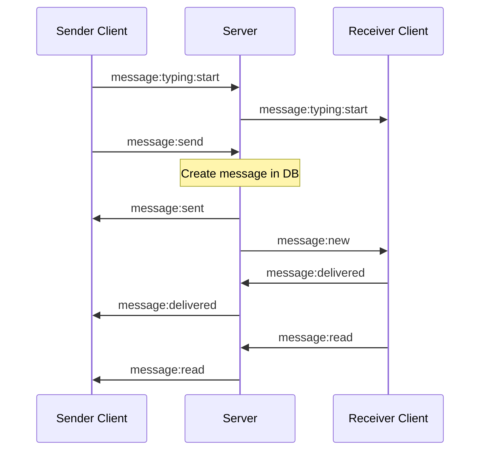
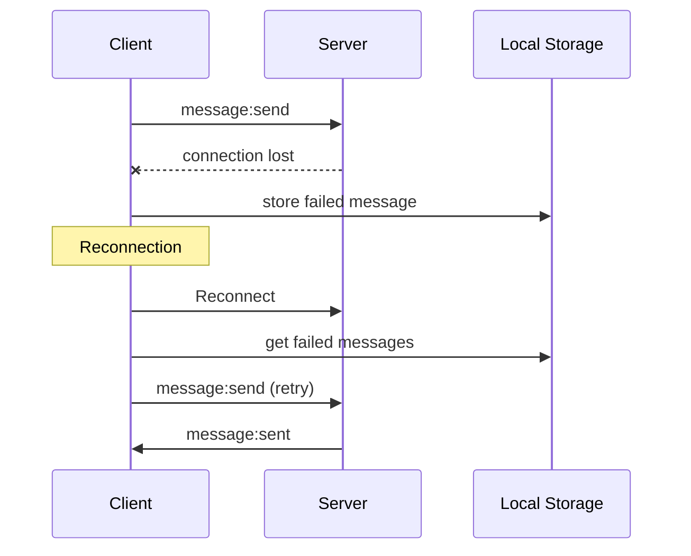
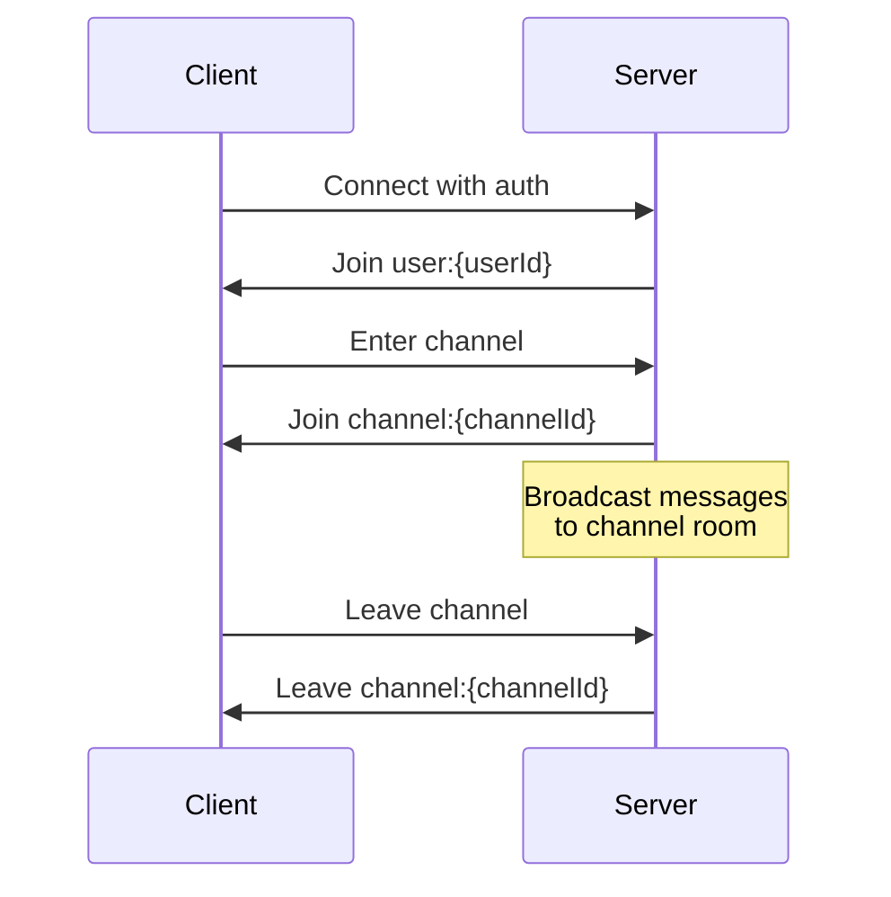

# Real-time Message Handling Documentation

## WebSocket Events

### Message Events
```typescript
enum MessageEvent {
  // Sending/receiving messages
  SEND = 'message:send',
  NEW = 'message:new',
  SENT = 'message:sent',
  
  // Typing indicators
  TYPING_START = 'message:typing:start',
  TYPING_STOP = 'message:typing:stop',
  
  // Delivery status
  DELIVERED = 'message:delivered',
  READ = 'message:read',
  
  // Error events
  ERROR = 'message:error'
}

enum MessageDeliveryStatus {
  SENT = 'SENT',
  DELIVERED = 'DELIVERED',
  READ = 'READ',
  FAILED = 'FAILED'
}
```

## Message Flow

### 1. Sending a Message
```typescript
// Frontend emits
socket.emit('message:send', {
  content: string;
  channelId: string;
  parentId?: string;  // Optional, for replies
  deliveryStatus?: MessageDeliveryStatus;
});

// Frontend receives
socket.on('message:sent', {
  messageId: string;
  channelId: string;
  status: MessageDeliveryStatus.SENT;
});

// Other channel members receive
socket.on('message:new', {
  id: string;
  content: string;
  channelId: string;
  userId: string;
  parentId?: string;
  createdAt: Date;
  updatedAt: Date;
  deliveryStatus: MessageDeliveryStatus;
  user: {
    id: string;
    name: string;
    // ... other user fields
  }
});
```

### 2. Typing Indicators
```typescript
// Start typing
socket.emit('message:typing:start', {
  channelId: string;
  isTyping: true;
});

// Stop typing
socket.emit('message:typing:stop', {
  channelId: string;
  isTyping: false;
});

// Receiving typing updates
socket.on('message:typing:start', {
  userId: string;
  channelId: string;
  isTyping: true;
});

socket.on('message:typing:stop', {
  userId: string;
  channelId: string;
  isTyping: false;
});
```

### 3. Message Delivery Status
```typescript
// Mark as delivered
socket.emit('message:delivered', {
  messageId: string;
  channelId: string;
  status: MessageDeliveryStatus.DELIVERED;
});

// Mark as read
socket.emit('message:read', {
  messageId: string;
  channelId: string;
  status: MessageDeliveryStatus.READ;
});

// Receiving delivery updates
socket.on('message:delivered', {
  messageId: string;
  channelId: string;
  status: MessageDeliveryStatus;
});

socket.on('message:read', {
  messageId: string;
  channelId: string;
  status: MessageDeliveryStatus;
});
```

## Implementation Guide

### 1. Socket Connection
```typescript
// Initialize socket connection
const socket = io(SOCKET_URL, {
  auth: {
    userId: currentUser.id,
    token: authToken
  },
  withCredentials: true
});

// Handle connection errors
socket.on('connect_error', (error) => {
  if (error.message === 'Unauthorized') {
    // Handle authentication error
  }
});
```

### 2. Channel Room Management
- Socket automatically joins user's room on connection: `user:{userId}`
- Join channel room when entering a channel: `channel:{channelId}`
- Messages are broadcast to channel rooms
- Delivery status updates are sent to user rooms

### 3. Error Handling
```typescript
socket.on('message:error', ({ error }) => {
  // Handle error (e.g., show toast notification)
  console.error('Message error:', error);
});
```

### 4. Message Lifecycle
1. User starts typing -> Emit `TYPING_START`
2. User stops typing -> Emit `TYPING_STOP`
3. User sends message -> Emit `SEND`
4. Server confirms -> Receive `SENT`
5. Other users receive -> `NEW`
6. Other users mark as delivered -> Emit `DELIVERED`
7. Other users mark as read -> Emit `READ`

### 5. Best Practices
1. **Debounce Typing Events**
```typescript
const debouncedTyping = debounce((isTyping: boolean) => {
  socket.emit(
    isTyping ? 'message:typing:start' : 'message:typing:stop',
    { channelId, isTyping }
  );
}, 300);
```

2. **Automatic Delivery Status**
```typescript
// Mark messages as delivered when receiving new messages
socket.on('message:new', (message) => {
  // Add message to UI
  addMessageToUI(message);
  
  // Mark as delivered
  socket.emit('message:delivered', {
    messageId: message.id,
    channelId: message.channelId,
    status: MessageDeliveryStatus.DELIVERED
  });
});
```

3. **Read Status on Channel Focus**
```typescript
function handleChannelFocus(channelId: string) {
  // Mark all unread messages as read
  unreadMessages.forEach(message => {
    socket.emit('message:read', {
      messageId: message.id,
      channelId,
      status: MessageDeliveryStatus.READ
    });
  });
}
```

4. **Offline Message Handling**
```typescript
// Store failed messages in local storage
function handleMessageError(message) {
  const offlineMessages = JSON.parse(
    localStorage.getItem('offlineMessages') || '[]'
  );
  offlineMessages.push({
    ...message,
    status: MessageDeliveryStatus.FAILED
  });
  localStorage.setItem('offlineMessages', JSON.stringify(offlineMessages));
}

// Retry failed messages on reconnection
socket.on('connect', () => {
  const offlineMessages = JSON.parse(
    localStorage.getItem('offlineMessages') || '[]'
  );
  offlineMessages.forEach(message => {
    socket.emit('message:send', message);
  });
  localStorage.removeItem('offlineMessages');
});
```

## Sequence Diagrams

### 1. Message Sending Flow


### 2. Error Recovery Flow


### 3. Channel Room Management


## Specific Implementation Examples

### 1. Complete Message Handler Setup
```typescript
// messageHandlers.ts
import { Socket } from 'socket.io-client';
import { MessageEvent, MessageDeliveryStatus } from './types';

export class MessageHandlers {
  constructor(
    private socket: Socket,
    private channelId: string,
    private onMessageReceived: (message: any) => void,
    private onTypingUpdate: (data: any) => void,
    private onDeliveryUpdate: (data: any) => void
  ) {
    this.setupHandlers();
  }

  private setupHandlers() {
    // New message handler
    this.socket.on(MessageEvent.NEW, (message) => {
      this.onMessageReceived(message);
      this.markAsDelivered(message);
    });

    // Typing indicators
    this.socket.on(MessageEvent.TYPING_START, this.onTypingUpdate);
    this.socket.on(MessageEvent.TYPING_STOP, this.onTypingUpdate);

    // Delivery status
    this.socket.on(MessageEvent.DELIVERED, this.onDeliveryUpdate);
    this.socket.on(MessageEvent.READ, this.onDeliveryUpdate);

    // Error handling
    this.socket.on(MessageEvent.ERROR, this.handleError);
  }

  private markAsDelivered(message: any) {
    this.socket.emit(MessageEvent.DELIVERED, {
      messageId: message.id,
      channelId: this.channelId,
      status: MessageDeliveryStatus.DELIVERED
    });
  }

  private handleError(error: any) {
    console.error('Message error:', error);
    // Implement error handling
  }

  public cleanup() {
    [
      MessageEvent.NEW,
      MessageEvent.TYPING_START,
      MessageEvent.TYPING_STOP,
      MessageEvent.DELIVERED,
      MessageEvent.READ,
      MessageEvent.ERROR
    ].forEach(event => {
      this.socket.off(event);
    });
  }
}
```

### 2. React Hook Implementation
```typescript
// useMessageHandling.ts
import { useEffect, useCallback } from 'react';
import { useSocket } from './useSocket';
import { MessageHandlers } from './messageHandlers';
import { debounce } from 'lodash';

export function useMessageHandling(channelId: string) {
  const socket = useSocket();

  const handleMessageReceived = useCallback((message) => {
    // Update your message list state
  }, []);

  const handleTypingUpdate = useCallback((data) => {
    // Update typing indicator state
  }, []);

  const handleDeliveryUpdate = useCallback((data) => {
    // Update message delivery status
  }, []);

  const sendMessage = useCallback((content: string, parentId?: string) => {
    socket.emit('message:send', {
      content,
      channelId,
      parentId,
      deliveryStatus: 'SENT'
    });
  }, [socket, channelId]);

  const debouncedTyping = useCallback(
    debounce((isTyping: boolean) => {
      socket.emit(
        isTyping ? 'message:typing:start' : 'message:typing:stop',
        { channelId, isTyping }
      );
    }, 300),
    [socket, channelId]
  );

  useEffect(() => {
    if (!socket || !channelId) return;

    const handlers = new MessageHandlers(
      socket,
      channelId,
      handleMessageReceived,
      handleTypingUpdate,
      handleDeliveryUpdate
    );

    return () => handlers.cleanup();
  }, [socket, channelId]);

  return {
    sendMessage,
    updateTyping: debouncedTyping
  };
}
```

## Troubleshooting Guide

### 1. Connection Issues
| Problem | Possible Causes | Solution |
|---------|----------------|----------|
| `connect_error` with "Unauthorized" | - Invalid/expired token<br/>- Missing auth data | - Check auth token<br/>- Verify auth object structure |
| Socket disconnects frequently | - Network issues<br/>- Server timeout | - Implement reconnection logic<br/>- Check heartbeat config |
| Messages not received | - Not joined to room<br/>- Wrong channel ID | - Verify room subscription<br/>- Log channel IDs |

### 2. Message Delivery Issues
| Problem | Possible Causes | Solution |
|---------|----------------|----------|
| Messages stuck in "SENT" | - Receiver offline<br/>- Room join failed | - Implement retry logic<br/>- Verify room membership |
| Duplicate messages | - Multiple room joins<br/>- Retry logic issue | - Track message IDs<br/>- Implement deduplication |
| Missing delivery updates | - Wrong user room<br/>- Event handler missing | - Check room format<br/>- Verify event listeners |

### 3. Performance Issues
| Problem | Possible Causes | Solution |
|---------|----------------|----------|
| High latency | - Too many connections<br/>- Large payloads | - Implement connection pooling<br/>- Optimize payload size |
| Memory leaks | - Uncleaned listeners<br/>- Accumulated messages | - Implement cleanup<br/>- Paginate messages |
| UI lag | - Too many updates<br/>- Render bottlenecks | - Debounce events<br/>- Virtualize message list |

### 4. Common Error Messages
```typescript
// Error: Already connected to room
Solution: Check room joining logic
```typescript
if (!this.rooms.has(`channel:${channelId}`)) {
  socket.emit('room:join', { channelId });
}
```

// Error: Message delivery timeout
Solution: Implement retry with backoff
```typescript
function sendWithRetry(message, attempts = 0) {
  try {
    socket.emit('message:send', message);
  } catch (error) {
    if (attempts < 3) {
      setTimeout(() => {
        sendWithRetry(message, attempts + 1);
      }, Math.pow(2, attempts) * 1000);
    } else {
      handleMessageError(message);
    }
  }
}
```

// Error: Invalid message format
Solution: Validate message before sending
```typescript
function validateMessage(message) {
  const required = ['content', 'channelId'];
  const missing = required.filter(field => !message[field]);
  if (missing.length) {
    throw new Error(`Missing required fields: ${missing.join(', ')}`);
  }
}
```

## Testing Guidelines

### 1. Unit Testing Socket Events
```typescript
// messageHandlers.test.ts
import { MessageHandlers } from './messageHandlers';
import { Socket } from 'socket.io-client';
import { MessageEvent, MessageDeliveryStatus } from './types';

describe('MessageHandlers', () => {
  let socket: jest.Mocked<Socket>;
  let handlers: MessageHandlers;
  let onMessageReceived: jest.Mock;
  let onTypingUpdate: jest.Mock;
  let onDeliveryUpdate: jest.Mock;

  beforeEach(() => {
    socket = {
      on: jest.fn(),
      emit: jest.fn(),
      off: jest.fn(),
    } as any;

    onMessageReceived = jest.fn();
    onTypingUpdate = jest.fn();
    onDeliveryUpdate = jest.fn();

    handlers = new MessageHandlers(
      socket,
      'test-channel',
      onMessageReceived,
      onTypingUpdate,
      onDeliveryUpdate
    );
  });

  it('should handle new messages', () => {
    const message = {
      id: '123',
      content: 'test',
      channelId: 'test-channel'
    };

    // Get the callback passed to socket.on
    const callback = socket.on.mock.calls.find(
      call => call[0] === MessageEvent.NEW
    )[1];

    callback(message);

    expect(onMessageReceived).toHaveBeenCalledWith(message);
    expect(socket.emit).toHaveBeenCalledWith(MessageEvent.DELIVERED, {
      messageId: message.id,
      channelId: 'test-channel',
      status: MessageDeliveryStatus.DELIVERED
    });
  });

  // Add more test cases...
});
```

### 2. Integration Testing
```typescript
// messageIntegration.test.ts
import { io, Socket } from 'socket.io-client';
import { createServer } from 'http';
import { Server } from 'socket.io';

describe('Message Integration', () => {
  let clientSocket: Socket;
  let serverSocket: Server;
  let httpServer: any;

  beforeAll((done) => {
    httpServer = createServer();
    serverSocket = new Server(httpServer);
    httpServer.listen(() => {
      const port = (httpServer.address() as any).port;
      clientSocket = io(`http://localhost:${port}`);
      clientSocket.on('connect', done);
    });
  });

  afterAll(() => {
    serverSocket.close();
    clientSocket.close();
    httpServer.close();
  });

  test('should handle message sending flow', (done) => {
    const testMessage = {
      content: 'test message',
      channelId: 'test-channel'
    };

    serverSocket.on('message:send', (data) => {
      expect(data).toEqual(testMessage);
      done();
    });

    clientSocket.emit('message:send', testMessage);
  });
});
```

### 3. E2E Testing with Cypress
```typescript
// cypress/integration/message.spec.ts
describe('Message Features', () => {
  beforeEach(() => {
    cy.login();
    cy.visit('/chat/channel/123');
  });

  it('should send and receive messages', () => {
    // Type and send message
    cy.get('[data-testid="message-input"]')
      .type('Hello World');
    cy.get('[data-testid="send-button"]')
      .click();

    // Verify message appears
    cy.get('[data-testid="message-list"]')
      .should('contain', 'Hello World');

    // Verify delivery status
    cy.get('[data-testid="message-status"]')
      .should('have.text', 'Sent')
      .should('have.text', 'Delivered', { timeout: 5000 });
  });

  it('should show typing indicators', () => {
    cy.get('[data-testid="message-input"]')
      .type('Hello');

    // Verify typing indicator appears for other users
    cy.get('[data-testid="typing-indicator"]')
      .should('be.visible')
      .should('contain', 'User is typing...');

    // Verify indicator disappears
    cy.wait(1000);
    cy.get('[data-testid="typing-indicator"]')
      .should('not.exist');
  });
});
```

## Security Considerations

### 1. Authentication & Authorization
```typescript
// socket.middleware.ts
import { Socket } from 'socket.io';
import { verify } from 'jsonwebtoken';

export const authMiddleware = (socket: Socket, next: (err?: Error) => void) => {
  const token = socket.handshake.auth.token;
  
  if (!token) {
    return next(new Error('Authentication token missing'));
  }

  try {
    const decoded = verify(token, process.env.JWT_SECRET);
    socket.data.user = decoded;
    next();
  } catch (error) {
    next(new Error('Invalid token'));
  }
};

// Rate limiting
import rateLimit from 'express-rate-limit';
import socketRateLimit from 'socket.io-rate-limiter';

const limiter = socketRateLimit({
  points: 10,           // Number of messages
  duration: 1,          // Per second
  errorMessage: 'Too many messages, please slow down.'
});

io.use((socket, next) => {
  if (limiter.tryRemoveTokens(1)) {
    next();
  } else {
    next(new Error('Rate limit exceeded'));
  }
});
```

### 2. Data Validation
```typescript
// messageValidation.ts
import { z } from 'zod';

export const MessageSchema = z.object({
  content: z.string().min(1).max(2000),
  channelId: z.string().uuid(),
  parentId: z.string().uuid().optional(),
  deliveryStatus: z.enum(['SENT', 'DELIVERED', 'READ', 'FAILED']).optional()
});

// Use in socket handler
socket.on('message:send', async (data) => {
  try {
    const validatedData = MessageSchema.parse(data);
    // Process message...
  } catch (error) {
    socket.emit('message:error', {
      error: 'Invalid message format'
    });
  }
});
```

### 3. XSS Prevention
```typescript
// messageUtils.ts
import DOMPurify from 'dompurify';
import { marked } from 'marked';

export const sanitizeMessage = (content: string): string => {
  // First convert markdown to HTML
  const html = marked(content);
  // Then sanitize HTML
  return DOMPurify.sanitize(html, {
    ALLOWED_TAGS: ['p', 'b', 'i', 'em', 'strong', 'a'],
    ALLOWED_ATTR: ['href']
  });
};

// Use in message handler
socket.on('message:send', (data) => {
  const sanitizedContent = sanitizeMessage(data.content);
  // Process sanitized message...
});
```

## Deployment Recommendations

### 1. Scaling WebSocket Connections
```typescript
// Use Redis adapter for multiple server instances
import { createAdapter } from '@socket.io/redis-adapter';
import { createClient } from 'redis';

const pubClient = createClient({ url: 'redis://localhost:6379' });
const subClient = pubClient.duplicate();

io.adapter(createAdapter(pubClient, subClient));

// Implement sticky sessions for load balancing
const redisClient = createClient({
  host: process.env.REDIS_HOST,
  port: parseInt(process.env.REDIS_PORT)
});

io.use(async (socket, next) => {
  const sessionID = socket.handshake.auth.sessionID;
  if (sessionID) {
    const session = await redisClient.get(`session:${sessionID}`);
    if (session) {
      socket.data.session = JSON.parse(session);
      return next();
    }
  }
  next(new Error('No session'));
});
```

### 2. Monitoring and Logging
```typescript
// Monitor socket connections and events
import { monitor } from '@socket.io/admin-ui';

monitor(io, {
  auth: {
    type: 'basic',
    username: process.env.ADMIN_USER,
    password: process.env.ADMIN_PASS
  }
});

// Implement comprehensive logging
import winston from 'winston';

const logger = winston.createLogger({
  level: 'info',
  format: winston.format.json(),
  transports: [
    new winston.transports.File({ filename: 'error.log', level: 'error' }),
    new winston.transports.File({ filename: 'combined.log' })
  ]
});

io.on('connection', (socket) => {
  logger.info('Client connected', {
    socketId: socket.id,
    userId: socket.data.user.id,
    timestamp: new Date()
  });

  socket.on('message:send', (data) => {
    logger.info('Message sent', {
      socketId: socket.id,
      userId: socket.data.user.id,
      messageId: data.id,
      channelId: data.channelId,
      timestamp: new Date()
    });
  });
});
```

### 3. Performance Optimization
```typescript
// Implement connection pooling
const pool = new Pool({
  max: 20,
  min: 5,
  idle: 10000
});

// Implement message batching for bulk operations
let messageQueue = [];
const BATCH_SIZE = 100;
const FLUSH_INTERVAL = 5000;

setInterval(() => {
  if (messageQueue.length > 0) {
    processBatch(messageQueue);
    messageQueue = [];
  }
}, FLUSH_INTERVAL);

function processBatch(messages) {
  // Bulk insert into database
  return pool.query(
    'INSERT INTO messages (id, content, channel_id, user_id) VALUES ?',
    [messages.map(m => [m.id, m.content, m.channelId, m.userId])]
  );
}

// Implement message compression
import compression from 'compression';
app.use(compression());

io.on('connection', (socket) => {
  socket.compress(true).emit('message:new', message);
});
```

## Final Checklist

### 1. Implementation
- [ ] WebSocket events properly defined and documented
- [ ] Message handling logic implemented
- [ ] Typing indicators working
- [ ] Delivery status updates functioning
- [ ] Error handling in place
- [ ] Offline message support added

### 2. Testing
- [ ] Unit tests written and passing
- [ ] Integration tests completed
- [ ] E2E tests implemented
- [ ] Load testing performed
- [ ] Security testing conducted

### 3. Security
- [ ] Authentication middleware implemented
- [ ] Rate limiting in place
- [ ] Input validation added
- [ ] XSS prevention implemented
- [ ] CORS properly configured

### 4. Deployment
- [ ] Scaling strategy defined
- [ ] Monitoring setup
- [ ] Logging implemented
- [ ] Performance optimizations applied
- [ ] Documentation completed 